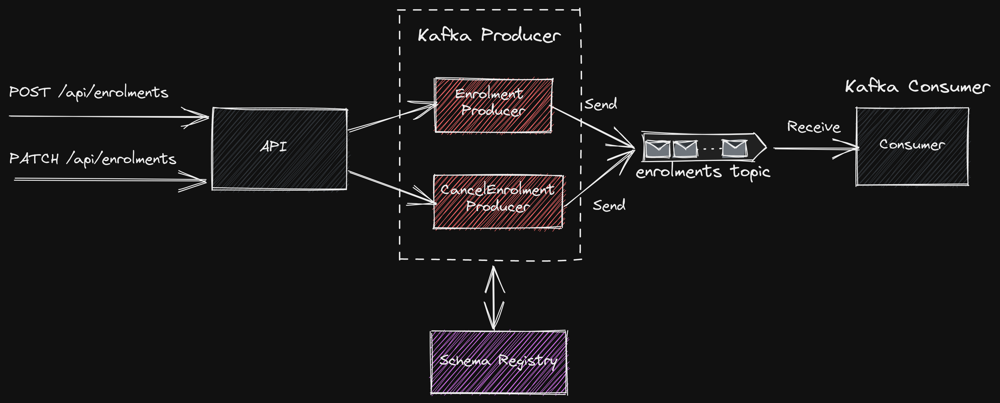

# Kafka Avro App

## Introduction
This is a concept implementation of a Microservice architecture which uses Kafka as a message broker. The app demonstrates usage of Confluent Schema Registry to provide strongly typed events/messages using Avro format to integrate with Kafka.

The concepts demonstrated are as follows:
- Definition of event/message schema using Apache Avro.
- Strongly typed producers and consumers.
- How to support multiple event types in a single topic with strict adherence to the defined schemas.
- How to model schemas using Avro union types.
- Usage of Kafka record headers.
- An alternate approach of using message header and payload structure instead of the Avro union types.

The following articles are useful references on this topic for further reading.
- [Should You Put Several Event Types in the Same Kafka Topic?](https://www.confluent.io/blog/put-several-event-types-kafka-topic/)
- [Putting Several Event Types in the Same Topic – Revisited](https://www.confluent.io/blog/multiple-event-types-in-the-same-kafka-topic/)

This concept implementation is built with the following technologies:
- Java 17
- Spring Boot
- Apache Kafka
- Spring Kafka
- Confluent Schema Registry
- Apache Avro Data Serialization

## Details
The use case demonstrated here requires support for processing customer enrolments and cancellations. The enrolment and cancellation processes produces messages to a Kafka topic which will be picked up by consumers and processes the requests as they arrive. The order of messages is very important whilst processing. For example, the cancellation request shouldn't appear before an enrolment request is in place. In order to achieve such ordering guarantee while using Kafka, it is preferable to process both messages via a single topic.



## Pre-requisites
 To run this setup, some pre-requisites are required to be installed and configured. Following are some guides which should help.

 - [Setup Linux VM on Azure](https://ramamurthyk.github.io/notes/Linux%20Setup%20on%20Azure%207100b190bfac4cc2a089ec436d50a95b)
 - [Java Setup](https://ramamurthyk.github.io/notes/Linux%20Setup%20on%20Azure%207100b190bfac4cc2a089ec436d50a95b/Java%20Setup%20on%20Linux%2036774edcda1343ae9bb9cfde10cdba6c)
 - [Docker Setup](https://ramamurthyk.github.io/notes/Linux%20Setup%20on%20Azure%207100b190bfac4cc2a089ec436d50a95b/Docker%20Setup%20on%20Linux%20b60c631d0f0b40288a4bb64b6aac82c8)
 - [Kafka Setup](https://ramamurthyk.github.io/notes/Linux%20Setup%20on%20Azure%207100b190bfac4cc2a089ec436d50a95b/Kafka%20Setup%20on%20Linux%2013001e06272949d8ab85130d54c98e62)
 - [VS Code Setup](https://ramamurthyk.github.io/notes/Linux%20Setup%20on%20Azure%207100b190bfac4cc2a089ec436d50a95b/VS%20Code%20Setup%20on%20Linux%20e92fb84f2c914205bb007c42a40d0d98)

## Code setup
- Clone the git repo locally
- Open in VS Code or any Java IDE
- Open the terminal and navigate to the root directory
  - execute mvn clean
  - execute mvn compile package

## Avro Union Types

With union types, the schema can be structured per event/message type.

Avro schema for Create Enrolment:

```JSON
{
    "namespace": "app.kafka.avrodemo.schema",
    "type": "record",
    "name": "CreateEnrolment",
    "fields": [
        {
            "name": "customerId",
            "type": "int"
        },        
        {
            "name": "membershipId",
            "type": [
                "null",
                "string"
            ]
        },
        {
            "name": "programme",
            "type": "string"
        }
    ]
}
```

Avro schema for Cancellation:

```JSON
{
    "namespace": "app.kafka.avrodemo.schema",
    "type": "record",
    "name": "CancelEnrolment",
    "fields": [
        {
            "name": "customerId",
            "type": "int"
        },
        {
            "name": "programme",
            "type": "string"
        },
        {
            "name": "reason",
            "type": [
                "null",
                {
                    "type": "enum",
                    "name": "Reason",
                    "symbols": [
                        "NotUsed",
                        "EnrolledElseWhere",
                        "TooExpensive",
                        "PoorCustomerService"
                    ]
                }
            ]
        }
    ]
}
```
Create a union type schema which should be associated with the topic.

```JSON
[
    "app.kafka.avrodemo.schema.CreateEnrolment",
    "app.kafka.avrodemo.schema.CancelEnrolment"    
]
```

After the schemas have been registered with the schema registry, the serialisation process on the producer will validate the incoming message against registered schema and allows only when it matches either of the types registered in the system. This ensures multiple event/message types are supported with a strongly typed message guarantee.

This repo uses maven configuration to register schemas. Ensure the schemas are registered with the topic before sending any requests via REST API controllers.

### Maven Configuration

Kafka schema registry maven plugin configuration in pom.xml

```XML
<!-- Schema registration -->
<plugin>
    <groupId>io.confluent</groupId>
    <artifactId>kafka-schema-registry-maven-plugin</artifactId>
    <version>7.1.0</version>
    <configuration>
        <schemaRegistryUrls>
            <param>http://localhost:8081</param>
        </schemaRegistryUrls>
        <subjects>
            <messageHeader>src/main/avro/MessageHeader.avsc</messageHeader>
            <createEnrolment>src/main/avro/CreateEnrolment.avsc</createEnrolment>
            <cancelEnrolment>src/main/avro/CancelEnrolment.avsc</cancelEnrolment>		
            <enrolments-uniontype-value>src/main/avro/EnrolmentRequestMessageTypes.avsc</enrolments-uniontype-value>
            <enrolments-payloadtype-value>src/main/avro/EnrolmentRequest.avsc</enrolments-payloadtype-value>
        </subjects>
        <schemaTypes>
            <messageHeader>AVRO</messageHeader>
            <createEnrolment>AVRO</createEnrolment>
            <cancelEnrolment>AVRO</cancelEnrolment>
            <enrolments-uniontype-value>AVRO</enrolments-uniontype-value>
            <enrolments-payloadtype-value>AVRO</enrolments-payloadtype-value>
        </schemaTypes>
        <references>
            <enrolments-uniontype-value>							
                <reference>
                    <name>app.kafka.avrodemo.schema.CreateEnrolment</name>
                    <subject>createEnrolment</subject>
                </reference>
                <reference>
                    <name>app.kafka.avrodemo.schema.CancelEnrolment</name>
                    <subject>cancelEnrolment</subject>
                </reference>						
            </enrolments-uniontype-value>
            <enrolments-payloadtype-value>
                <reference>
                    <name>app.kafka.avrodemo.schema.MessageHeader</name>
                    <subject>messageHeader</subject>
                </reference>
                <reference>
                    <name>app.kafka.avrodemo.schema.CreateEnrolment</name>
                    <subject>createEnrolment</subject>
                </reference>
                <reference>
                    <name>app.kafka.avrodemo.schema.CancelEnrolment</name>
                    <subject>cancelEnrolment</subject>
                </reference>	
            </enrolments-payloadtype-value>
        </references>
    </configuration>
    <goals>
        <goal>register</goal>
    </goals>
</plugin>
```
Registers schemas via:

```Bash
$ mvn schema-registry:register
```
#### Inspection

Inspect the registered schemas and subjects via REST interface.

Schemas: 
http://localhost:8081/schemas

Subjects: http://localhost:8081/subjects

Topic view via Confluent Control Centre.


### Demo
#### Enrolment
Send a RESTful request to the API controller.

```Bash
POST http://localhost:8080/api/enrolments-uniontype
```
```JSON
{
  "customerId": 1000,
  "membershipId": {
    "string": "M1234"
  },
  "programme": "Mindfullness"
}
```
Inspect the message in the topic: enrolments-uniontype

```JSON
Record headers:
[
  {
    "key": "x_messageId",
    "stringValue": "33fa9a86-cd62-4c9b-a38f-6ade40d7f898"
  },
  {
    "key": "x_messageType",
    "stringValue": "app.kafka.avrodemo.schema.CreateEnrolment"
  }
]

Data:
{
  "customerId": 1000,
  "membershipId": {
    "string": "M1234"
  },
  "programme": "Mindfullness"
}
```

#### Cancel Enrolment
Send a RESTful request to the API controller.

```Bash
PATCH http://localhost:8080/api/enrolments-uniontype
```
```JSON
{
    "customerId": 1000,
    "programme": "Mindfullness"
}
```
Inspect the message in the topic: enrolments-uniontype

```JSON
Record headers:
[
  {
    "key": "x_messageId",
    "stringValue": "d009b55c-0cdc-4ba4-960c-d41162164235"
  },
  {
    "key": "x_messageType",
    "stringValue": "app.kafka.avrodemo.schema.CancelEnrolment"
  }
]

Data:
{
  "customerId": 1000,
  "programme": "Mindfullness",
  "reason": {
    "app.kafka.avrodemo.schema.Reason": "PoorCustomerService"
  }
}
```


Custom record headers are generated by the producer with a naming convention of x_recordheadername.

## Avro Payload Types

An alternate approach is to use an envelope with the message header and payload structure for events/messages. This uses a custom structure to hold the message header with the messageType indicator and the data in a payload envelope.

Avro schema for Message Header:

```JSON
{
    "namespace": "app.kafka.avrodemo.schema",
    "type": "record",
    "name": "MessageHeader",
    "fields": [
        {
            "name": "messageId",
            "type": "string"
        },
        {
            "name": "messageType",
            "type": {
                "type": "enum",
                "name": "MessageType",
                "symbols": [
                    "CreateEnrolment",
                    "CancelEnrolment"
                ]
            }
        }
    ]
}
```

Create a composition schema which should be associated with the topic.

```JSON
{
    "namespace": "app.kafka.avrodemo.schema",
    "type": "record",
    "name": "EnrolmentRequest",
    "fields": [
        {
            "name": "header",
            "type": "app.kafka.avrodemo.schema.MessageHeader"
        },
        {
            "name": "payload",
            "type": [
                "app.kafka.avrodemo.schema.CreateEnrolment",
                "app.kafka.avrodemo.schema.CancelEnrolment"   
            ]
        }
    ]
}
```

### Demo
#### Enrolment
Send a RESTful request to the API controller.

```Bash
POST http://localhost:8080/api/enrolments-payloadtype
```
```JSON
{
    "customerId": 1000,
    "programme": "Mindfullness",
    "membershipId": "M1234"
}
```
Inspect the message in the topic: enrolments-payloadtype

```JSON
{
  "header": {
    "messageId": "4f585243-95f7-4133-b91d-da6ef7175049",
    "messageType": "CreateEnrolment"
  },
  "payload": {
    "app.kafka.avrodemo.schema.CreateEnrolment": {
      "customerId": 1000,
      "membershipId": {
        "string": "M1234"
      },
      "programme": "Mindfullness"
    }
  }
}
```

#### Cancel Enrolment
Send a RESTful request to the API controller.

```Bash
PATCH http://localhost:8080/api/enrolments-payloadtype
```
```JSON
{
    "customerId": 1000,
    "programme": "Mindfullness"
}
```
Inspect the message in the topic: enrolments-payloadtype

```JSON
{
  "header": {
    "messageId": "c8d4fa81-3fb8-473e-8156-7b79a33c5dac",
    "messageType": "CancelEnrolment"
  },
  "payload": {
    "app.kafka.avrodemo.schema.CancelEnrolment": {
      "customerId": 1000,
      "programme": "Mindfullness",
      "reason": {
        "app.kafka.avrodemo.schema.Reason": "TooExpensive"
      }
    }
  }
}
```

Note the usage of custom header structure. Consumers will need to decode the payload into a typed object.

## Conclusion
This concept implementation demonstrates the usage of Apache Avro and Confluent Schema Registry to build strongly typed microservices and Kafka producer and consumers. It demonstrates different approaches to store multiple events/messages in a single topic using union types and a custom envelope payload based structure with strong typing which may be required in certain scenarios. Hopefully this should be a good starting point for anyone looking for a reference implementation.