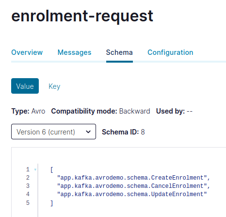

# Avro Union Types with Confluent Schema Registry

## Union Type Schema
EnrolmentRequestMessageTypes.avsc
```JSON
[
  "app.kafka.avrodemo.schema.CreateEnrolment",
  "app.kafka.avrodemo.schema.CancelEnrolment",
  "app.kafka.avrodemo.schema.UpdateEnrolment"
]
```
## Schema Registration
### Maven Configuration
Kafka schema registry maven plugin configuration in pom.xml
```XML
<plugin>
    <groupId>io.confluent</groupId>
    <artifactId>kafka-schema-registry-maven-plugin</artifactId>
    <version>7.1.0</version>
    <configuration>
        <schemaRegistryUrls>
            <param>http://localhost:8081</param>
        </schemaRegistryUrls>
        <subjects>
            <enrolment-request-value>src/main/avro/EnrolmentRequestMessageTypes.avsc</enrolment-request-value>						
            <createenrolment>src/main/avro/CreateEnrolment.avsc</createenrolment>
            <cancelenrolment>src/main/avro/CancelEnrolment.avsc</cancelenrolment>
            <updateenrolment>src/main/avro/UpdateEnrolment.avsc</updateenrolment>					
        </subjects>
        <schemaTypes>
            <enrolment-request-value>AVRO</enrolment-request-value>
            <messageheader>AVRO</messageheader>
            <createenrolment>AVRO</createenrolment>
            <cancelenrolment>AVRO</cancelenrolment>
            <updateenrolment>AVRO</updateenrolment>
        </schemaTypes>
        <references>
            <enrolment-request-value>							
                <reference>
                    <name>app.kafka.avrodemo.schema.CreateEnrolment</name>
                    <subject>createenrolment</subject>
                </reference>
                <reference>
                    <name>app.kafka.avrodemo.schema.CancelEnrolment</name>
                    <subject>cancelenrolment</subject>
                </reference>
                <reference>
                    <name>app.kafka.avrodemo.schema.UpdateEnrolment</name>
                    <subject>updateenrolment</subject>
                </reference>						
            </enrolment-request-value>
        </references>
    </configuration>
    <goals>
        <goal>register</goal>
    </goals>
</plugin>
```

### Register Command
```Bash
$ mvn schema-registry:register
```
## Schema Registry
Inspect the registered schemas and subjects via REST interface.

### Schemas
http://localhost:8081/schemas

```JSON
[
  {
    "subject": "cancelenrolment",
    "version": 1,
    "id": 3,
    "schema": "{\"type\":\"record\",\"name\":\"CancelEnrolment\",\"namespace\":\"app.kafka.avrodemo.schema\",\"fields\":[{\"name\":\"entityId\",\"type\":\"int\"},{\"name\":\"rewardName\",\"type\":\"string\"},{\"name\":\"reasonCode\",\"type\":[\"null\",{\"type\":\"enum\",\"name\":\"ReasonCode\",\"symbols\":[\"MemberRequested\",\"PolicyCancelled\",\"PartnerMembershipCancelled\"]}]}]}"
  },
  {
    "subject": "createenrolment",
    "version": 1,
    "id": 6,
    "schema": "{\"type\":\"record\",\"name\":\"CreateEnrolment\",\"namespace\":\"app.kafka.avrodemo.schema\",\"fields\":[{\"name\":\"entityId\",\"type\":\"int\"},{\"name\":\"rewardName\",\"type\":\"string\"},{\"name\":\"rewardMembershipId\",\"type\":[\"null\",\"string\"]}]}"
  },
  {
    "subject": "enrolment-request-value",
    "version": 6,
    "id": 8,
    "references": [
      {
        "name": "app.kafka.avrodemo.schema.CreateEnrolment",
        "subject": "createenrolment",
        "version": 1
      },
      {
        "name": "app.kafka.avrodemo.schema.CancelEnrolment",
        "subject": "cancelenrolment",
        "version": 1
      },
      {
        "name": "app.kafka.avrodemo.schema.UpdateEnrolment",
        "subject": "updateenrolment",
        "version": 1
      }
    ],
    "schema": "[\"app.kafka.avrodemo.schema.CreateEnrolment\",\"app.kafka.avrodemo.schema.CancelEnrolment\",\"app.kafka.avrodemo.schema.UpdateEnrolment\"]"
  },
  {
    "subject": "messageheader",
    "version": 1,
    "id": 5,
    "schema": "{\"type\":\"record\",\"name\":\"MessageHeader\",\"namespace\":\"app.kafka.avrodemo.schema\",\"fields\":[{\"name\":\"eventName\",\"type\":{\"type\":\"enum\",\"name\":\"EventName\",\"symbols\":[\"CreateEnrolment\",\"CancelEnrolment\",\"UpdateEnrolment\"]}}]}"
  },
  {
    "subject": "updateenrolment",
    "version": 1,
    "id": 4,
    "schema": "{\"type\":\"record\",\"name\":\"UpdateEnrolment\",\"namespace\":\"app.kafka.avrodemo.schema\",\"fields\":[{\"name\":\"rewardName\",\"type\":\"string\"},{\"name\":\"rewardMembershipId\",\"type\":\"string\"},{\"name\":\"rewardMembershipEmail\",\"type\":[\"null\",\"string\"]}]}"
  }
]
```
## Control Centre
Inspect the schema recorded against the topic in the control centre.

```JSON
[
  "app.kafka.avrodemo.schema.CreateEnrolment",
  "app.kafka.avrodemo.schema.CancelEnrolment",
  "app.kafka.avrodemo.schema.UpdateEnrolment"
]
```
As seen in Confluent Control Center



## Execute Application
### Enrolment

Send a RESTful request to the API controller.

```Bash
POST http://localhost:8080/api/enrolments
```
```JSON
{
    "entityId": 1000,
    "rewardName": "MindfulChef",
    "rewardMembershipId": "MC1234"
}
```
Inspect the message in the topic: enrolment-request

```JSON
{
  "entityId": 1000,
  "rewardName": "MindfulChef",
  "rewardMembershipId": {
    "string": "MC1234"
  }
}
```
Application logs
```Bash
2022-04-06 21:49:37.631 DEBUG 64158 --- [nio-8080-exec-2] o.s.web.servlet.DispatcherServlet        : POST "/api/enrolments", parameters={}
2022-04-06 21:49:37.671 DEBUG 64158 --- [nio-8080-exec-2] s.w.s.m.m.a.RequestMappingHandlerMapping : Mapped to app.kafka.avrodemo.enrolment.EnrolmentController#CreateEnrolment(CreateEnrolmentRequest)
2022-04-06 21:49:37.949 DEBUG 64158 --- [nio-8080-exec-2] m.m.a.RequestResponseBodyMethodProcessor : Read "application/json;charset=UTF-8" to [CreateEnrolmentRequest[entityId=1000, rewardName=MindfulChef, rewardMembershipId=MC1234]]
2022-04-06 21:49:37.954  INFO 64158 --- [nio-8080-exec-2] a.k.a.enrolment.EnrolmentController      : Received POST request to create enrolment

2022-04-06 21:49:38.172  INFO 64158 --- [nio-8080-exec-2] a.k.a.enrolment.EnrolmentProducer        : Produced -> key: 1000, value: {"entityId": 1000, "rewardName": "MindfulChef", "rewardMembershipId": "MC1234"}
2022-04-06 21:49:38.172  INFO 64158 --- [nio-8080-exec-2] app.kafka.avrodemo.common.RecordHeaders  : With record headers:
2022-04-06 21:49:38.173  INFO 64158 --- [nio-8080-exec-2] app.kafka.avrodemo.common.RecordHeaders  : x_messageId: 0f27bc01-0483-4c89-8adb-98e60931c0ff
2022-04-06 21:49:38.174  INFO 64158 --- [nio-8080-exec-2] app.kafka.avrodemo.common.RecordHeaders  : x_messageType: app.kafka.avrodemo.schema.CreateEnrolment

2022-04-06 21:49:38.259  INFO 64158 --- [rolment-2-0-C-1] a.k.a.enrolment.EnrolmentConsumer        : Received <- key: 1000. value: {"entityId": 1000, "rewardName": "MindfulChef", "rewardMembershipId": "MC1234"}
2022-04-06 21:49:38.260  INFO 64158 --- [rolment-2-0-C-1] app.kafka.avrodemo.common.RecordHeaders  : With record headers:
2022-04-06 21:49:38.261  INFO 64158 --- [rolment-2-0-C-1] app.kafka.avrodemo.common.RecordHeaders  : x_messageId: 0f27bc01-0483-4c89-8adb-98e60931c0ff
2022-04-06 21:49:38.262  INFO 64158 --- [rolment-2-0-C-1] app.kafka.avrodemo.common.RecordHeaders  : x_messageType: app.kafka.avrodemo.schema.CreateEnrolment
2022-04-06 21:49:38.262  INFO 64158 --- [rolment-2-0-C-1] a.k.a.enrolment.EnrolmentConsumer        : Processed messageType: app.kafka.avrodemo.schema.CreateEnrolment
```

### Cancel Enrolment

Send a RESTful request to the API controller.

```Bash
PATCH http://localhost:8080/api/enrolments
```
```JSON
{
    "entityId": 1000,
    "rewardName": "MindfulChef"
}
```
Inspect the message in the topic: enrolment-request

```JSON
{
  "entityId": 1000,
  "rewardName": "MindfulChef",
  "reasonCode": {
    "app.kafka.avrodemo.schema.ReasonCode": "MemberRequested"
  }
}
```
Application logs
```Bash
2022-04-06 21:52:02.795 DEBUG 65011 --- [nio-8080-exec-2] o.s.web.servlet.DispatcherServlet        : PATCH "/api/enrolments", parameters={}
2022-04-06 21:52:02.800 DEBUG 65011 --- [nio-8080-exec-2] s.w.s.m.m.a.RequestMappingHandlerMapping : Mapped to app.kafka.avrodemo.enrolment.EnrolmentController#CancelEnrolment(CancelEnrolmentRequest)
2022-04-06 21:52:02.928 DEBUG 65011 --- [nio-8080-exec-2] m.m.a.RequestResponseBodyMethodProcessor : Read "application/json;charset=UTF-8" to [CancelEnrolmentRequest[entityId=1000, rewardName=MindfulChef]]
2022-04-06 21:52:02.932  INFO 65011 --- [nio-8080-exec-2] a.k.a.enrolment.EnrolmentController      : Received PATCH request to cancel enrolment

2022-04-06 21:52:03.100  INFO 65011 --- [nio-8080-exec-2] a.k.a.enrolment.CancelEnrolmentProducer  : Produced -> key: 1000, value: {"entityId": 1000, "rewardName": "MindfulChef", "reasonCode": "MemberRequested"}
2022-04-06 21:52:03.101  INFO 65011 --- [nio-8080-exec-2] app.kafka.avrodemo.common.RecordHeaders  : With record headers:
2022-04-06 21:52:03.102  INFO 65011 --- [nio-8080-exec-2] app.kafka.avrodemo.common.RecordHeaders  : x_messageId: ff97bb6c-c1bf-4e2a-8c47-bea74d44e216
2022-04-06 21:52:03.102  INFO 65011 --- [nio-8080-exec-2] app.kafka.avrodemo.common.RecordHeaders  : x_messageType: app.kafka.avrodemo.schema.CancelEnrolment

2022-04-06 21:52:03.186  INFO 65011 --- [rolment-2-0-C-1] a.k.a.enrolment.EnrolmentConsumer        : Received <- key: 1000. value: {"entityId": 1000, "rewardName": "MindfulChef", "reasonCode": "MemberRequested"}
2022-04-06 21:52:03.187  INFO 65011 --- [rolment-2-0-C-1] app.kafka.avrodemo.common.RecordHeaders  : With record headers:
2022-04-06 21:52:03.188  INFO 65011 --- [rolment-2-0-C-1] app.kafka.avrodemo.common.RecordHeaders  : x_messageId: ff97bb6c-c1bf-4e2a-8c47-bea74d44e216
2022-04-06 21:52:03.189  INFO 65011 --- [rolment-2-0-C-1] app.kafka.avrodemo.common.RecordHeaders  : x_messageType: app.kafka.avrodemo.schema.CancelEnrolment
2022-04-06 21:52:03.190  INFO 65011 --- [rolment-2-0-C-1] a.k.a.enrolment.EnrolmentConsumer        : Processed messageType: app.kafka.avrodemo.schema.CancelEnrolment
```

## Producer Implementation
```Java
@Service
@Slf4j
public class EnrolmentProducer {
    ...
    @Autowired
    private KafkaTemplate<String, CreateEnrolment> template;  

    public void sendCreateMessage(CreateEnrolmentRequest request) {
        // Build message.
        CreateEnrolment createEnrolment = CreateEnrolment.newBuilder()
                .setEntityId(request.entityId())
                .setRewardName(request.rewardName()).setRewardMembershipId(request.rewardMembershipId())
                .build();

        // Create record.
        ProducerRecord<String, CreateEnrolment> record = new ProducerRecord<String, CreateEnrolment>(
                properties.enrolmentRequestTopic, null, Integer.toString(request.entityId()),
                createEnrolment);

        // Add headers.
        record.headers().add(new RecordHeader(RecordHeaderNames.MESSAGE_ID,
                UUID.randomUUID().toString().getBytes()));
        record.headers()
                .add(new RecordHeader(RecordHeaderNames.MESSAGE_TYPE,
                        MessageTypes.CREATE_ENROLMENT.getBytes()));

        // Send.
        this.template.send(record);
    }
}
```

## Consumer Implementation
```Java
@Component
@Slf4j
@KafkaListener(id = "${app.enrolment.kafka.consumer.group-id}", topics = "${app.topic.enrolment-request}")
public class EnrolmentConsumer {
    public void process(Headers headers, Object message) {
        ...
        // Get MessageType and process.
        String messageType = new String(headers.lastHeader(RecordHeaderNames.MESSAGE_TYPE).value(),
                StandardCharsets.UTF_8);

        switch (messageType) {
            case MessageTypes.CREATE_ENROLMENT:
                // Convert the message to a specific object..
                // Pseudocode: CreateEnrolment enrolment = convert(message);
                log.info(String.format("Processed messageType: %s", messageType));
                break;

            case MessageTypes.CANCEL_ENROLMENT:
                // Convert the message to a specific object..
                // Pseudocode: CancelEnrolment cancelEnrolment = convert(message);
                log.info(String.format("Processed messageType: %s", messageType));
                break;

            default:
                log.info(String.format("Processed messageType: %s", messageType));
                break;
        }
    }

    @KafkaHandler
    public void processEnrolmentRequest(ConsumerRecord<String, CreateEnrolment> record) {
        ...
        // This method is not being called. Requires investigation and potentially type matching configuration during Avro deserialisation.
    }

    @KafkaHandler
    public void processEnrolmentCancellation(ConsumerRecord<String, CancelEnrolment> record) {
        ...
         // This method is not being called. Requires investigation and potentially type matching configuration during Avro deserialisation.
    }

    @KafkaHandler(isDefault = true)
    public void processOtherMessages(ConsumerRecord<String, Object> record) {
        // Until the specific handlers can be selected and called, process all the events here.
        // This method would anyway be required to receive and acknowledge messages types which won be processed by this consumer.
        process(record.headers(), record.value());
    }
}
```